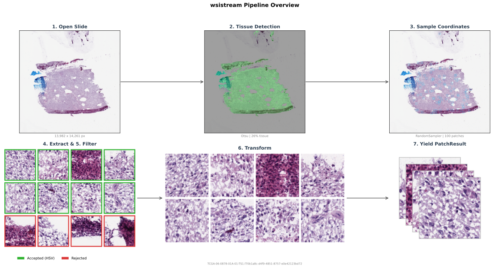

# `wsistream`

Modular online patch streaming from whole-slide images for computational pathology. Stream patches directly from WSIs during training (no disk pre-extraction, no storage overhead).

Every component is pluggable: backends, tissue detectors, samplers, filters, transforms, dataset adapters.

## Documentation

```bash
pip install mkdocs-material
mkdocs serve          # local preview at http://127.0.0.1:8000
mkdocs build          # static site in site/
```

## Install

```bash
git clone https://github.com/RamonKaspar/wsistream.git
cd wsistream
pip install -e ".[openslide]"   # with OpenSlide
pip install -e ".[tiffslide]"   # with TiffSlide (pure Python)
```

## How it works

Each slide goes through a fixed pipeline:

1. **Open slide**: via an explicit backend (`OpenSlideBackend` or `TiffSlideBackend`)
2. **Detect tissue**: run a `TissueDetector` on a low-res thumbnail to get a binary mask
3. **Sample coordinates**: a `PatchSampler` proposes (x, y) locations within tissue regions
4. **Extract patch**: read the pixel data from the slide at each coordinate
5. **Filter patch**: a `PatchFilter` accepts or rejects the tile based on its pixels
6. **Transform patch**: apply augmentations (`HEDColorAugmentation`, `RandomFlipRotate`, etc.)
7. **Yield result**: `PatchResult` with image, coordinates, tissue fraction, and metadata

<p align="center">
  
</p>

## Quick start

```python
from wsistream.pipeline import PatchPipeline
from wsistream.backends import OpenSlideBackend
from wsistream.tissue import CLAMTissueDetector
from wsistream.sampling import RandomSampler
from wsistream.filters import HSVPatchFilter
from wsistream.transforms import ComposeTransforms, HEDColorAugmentation, RandomFlipRotate, ResizeTransform
from wsistream.datasets import TCGAAdapter

pipeline = PatchPipeline(
    slide_paths=["slide_A.svs", "slide_B.svs", "slide_C.svs"],
    backend=OpenSlideBackend(),
    tissue_detector=CLAMTissueDetector(),
    sampler=RandomSampler(patch_size=256, num_patches=-1, target_mpp=0.5),
    patch_filter=HSVPatchFilter(min_pixel_fraction=0.6),
    transforms=ComposeTransforms(transforms=[
        HEDColorAugmentation(sigma=0.05),
        RandomFlipRotate(),
        ResizeTransform(target_size=224),
    ]),
    dataset_adapter=TCGAAdapter(),
    pool_size=8,
    patches_per_slide=100,
    cycle=True,
)

for result in pipeline:
    print(result.image.shape)                # (224, 224, 3) uint8
    print(result.coordinate.mpp)             # ~0.5
    print(result.tissue_fraction)            # 0.87
    print(result.slide_metadata.patient_id)  # TCGA-3L-AA1B
```

## Pool-based slide interleaving

The pipeline keeps `pool_size` slides open simultaneously and takes `patches_per_slide` patches from each before closing it and opening the next. With `cycle=True`, slides are re-queued for infinite streaming.

## PyTorch integration

`PatchPipeline` implements `__iter__`, so wrapping it in a PyTorch `IterableDataset` is straightforward. See [`examples/example_ddp_training.py`](examples/example_ddp_training.py) for the full pattern including DDP rank/worker splitting.
