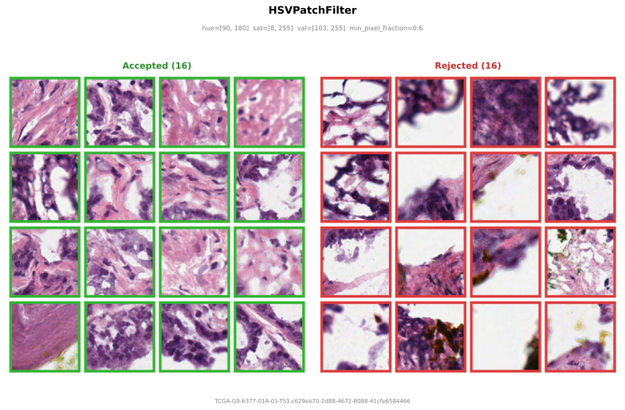

# Filters

Filters run on **actual extracted patch pixels**, after the patch is read from the WSI but before transforms are applied. They accept or reject individual patches based on their content.

This is distinct from [tissue detection](tissue-detection.md), which runs once per slide on a low-resolution thumbnail. Filters are more expensive (they run per patch) but see the actual pixel content at the sampled resolution.

<figure markdown="span">
  
  <figcaption>HSVPatchFilter applied to patches from a TCGA slide. Accepted patches (green) have sufficient tissue pixels in the HSV range; rejected patches (red) are mostly background, adipose, or out-of-range content.</figcaption>
</figure>

## HSVPatchFilter

Per-tile HSV pixel filter matching Midnight's tile acceptance criterion ([Karasikov et al., 2025](https://arxiv.org/abs/2504.05186)). A patch is accepted only if at least `min_pixel_fraction` of its pixels fall within the specified HSV ranges.

Midnight uses this to reject tiles with mostly adipose tissue, background, or other low-informative content that passed the coarse tissue detection.

```python
from wsistream.filters import HSVPatchFilter

patch_filter = HSVPatchFilter(
    hue_range=(90, 180),       # hue range (0-180 in OpenCV)
    sat_range=(8, 255),        # saturation range (0-255)
    val_range=(103, 255),      # value range (0-255)
    min_pixel_fraction=0.6,    # >=60% of pixels must pass
)
```

Use it in the pipeline:

```python
pipeline = PatchPipeline(
    ...,
    patch_filter=HSVPatchFilter(),
)
```

Rejected patches count toward the `patches_per_slide` budget but are not yielded. The pipeline moves to the next candidate coordinate.

## Writing your own

```python
import cv2
import numpy as np
from wsistream.filters.base import PatchFilter

class BlurFilter(PatchFilter):
    """Reject blurry patches using Laplacian variance."""

    def __init__(self, threshold: float = 100.0):
        self.threshold = threshold

    def accept(self, patch: np.ndarray) -> bool:
        gray = cv2.cvtColor(patch, cv2.COLOR_RGB2GRAY)
        return cv2.Laplacian(gray, cv2.CV_64F).var() > self.threshold
```
