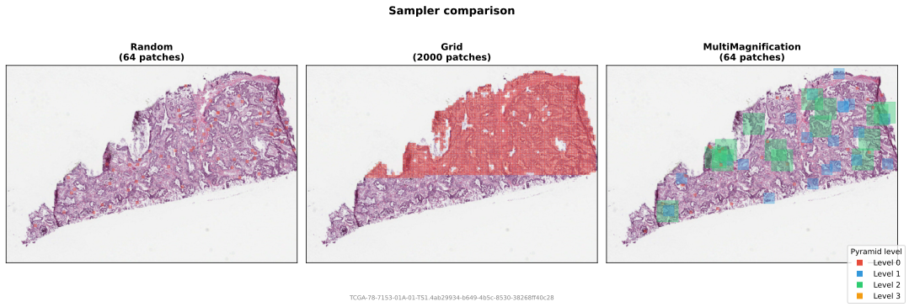
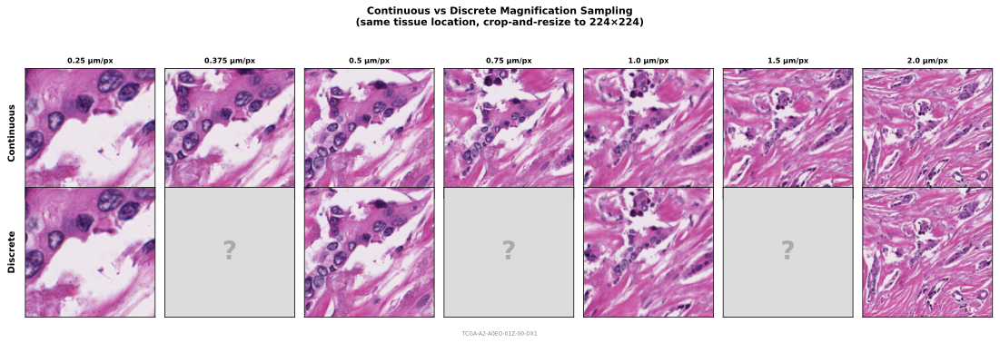

# Sampling

Samplers determine **where** to extract patches. They receive a `SlideHandle` and a `TissueMask`, and yield `PatchCoordinate` objects.

Samplers only propose coordinates based on the tissue mask (a coarse thumbnail-level check). The pipeline may still reject patches after extraction via a [PatchFilter](filters.md) (a fine-grained per-tile check).

<figure markdown="span">
  
  <figcaption>Comparison of the three sampling strategies on a TCGA slide. RandomSampler and MultiMagnificationSampler produce stochastic coordinates; GridSampler produces a deterministic grid. For MultiMagnificationSampler, colors indicate different pyramid levels.</figcaption>
</figure>

## RandomSampler

Uniform random sampling via rejection: draw random (x, y) from the slide bounds, check against the tissue mask, reject if below the tissue threshold, yield if above. This is the core online patching approach, proposed for FM pre-training by Kaiko ([Aben et al., 2024](https://arxiv.org/abs/2404.15217)).

```python
from wsistream.sampling import RandomSampler

sampler = RandomSampler(
    patch_size=256,          # width/height at the target level
    num_patches=100,         # patches per slide (-1 for infinite streaming)
    level=0,                 # pyramid level (ignored when target_mpp is set)
    target_mpp=None,         # desired um/px (picks the closest pyramid level per slide)
    tissue_threshold=0.4,    # minimum tissue fraction to accept a candidate
    max_retries=50,          # rejection attempts before giving up on one patch
    seed=42,                 # random seed
)
```

Set `num_patches=-1` for infinite streaming during training. The sampler will keep yielding patches indefinitely; use `patches_per_slide` in the pipeline to control how many are extracted from each slide.

When `target_mpp` is set, the sampler calls `SlideHandle.best_level_for_mpp()` to find the pyramid level closest to the desired microns-per-pixel for each slide, ignoring the `level` parameter. This is useful when slides come from different scanners with different native magnifications.

RandomSampler supports `replacement="without_replacement"` in the pipeline. See [Without-replacement sampling](#without-replacement-sampling) below.

## GridSampler

Exhaustive grid over the slide, keeping only patches with sufficient tissue. The grid defaults to non-overlapping (`stride=patch_size`), but the stride is configurable for overlapping extraction.

```python
from wsistream.sampling import GridSampler

sampler = GridSampler(
    patch_size=256,
    level=0,
    stride=None,             # defaults to patch_size (non-overlapping); set lower for overlap
    tissue_threshold=0.4,
)
```

GridSampler is deterministic and exhaustive -- it visits every grid position. This makes it suitable for feature extraction pipelines (e.g., CLAM-style), but not for stochastic online training.

## MultiMagnificationSampler

Randomly selects a pyramid level, then samples a random patch at that level. Midnight trains at 0.25, 0.5, 1.0, and 2.0 um/px ([Karasikov et al., 2025](https://arxiv.org/abs/2504.05186)). Each iteration picks one level at random.

```python
from wsistream.sampling import MultiMagnificationSampler

sampler = MultiMagnificationSampler(
    target_mpps=[0.25, 0.5, 1.0, 2.0],  # default matches Midnight
    mpp_weights=None,                     # uniform (or provide custom weights)
    patch_size=256,
    num_patches=-1,                       # -1 for infinite
    tissue_threshold=0.4,
    max_consecutive_failures=100,         # stop after this many consecutive failures
    seed=42,
)
```

!!! note "MPP metadata"
    Multi-magnification sampling requires that the slide file contains microns-per-pixel (MPP) metadata. Most TCGA SVS files include this. If MPP is unavailable, the sampler falls back to single-level (level 0) sampling with a `RandomSampler`.

MultiMagnificationSampler supports `replacement="without_replacement"` in the pipeline. See [Without-replacement sampling](#without-replacement-sampling) below.

## ContinuousMagnificationSampler

Instead of restricting training to a fixed set of scanner magnifications, this sampler synthesises patches at **arbitrary magnifications** via dynamic crop-and-resize operations. It reads a larger crop from the WSI and resizes it to `output_size`, producing patches at a continuously varying µm/px. The paper shows this eliminates the performance gaps at intermediate magnifications (up to +4 pp balanced accuracy) that are observed with discrete multi-scale sampling.

Based on [Möllers et al. (2026), "Mind the Gap: Continuous Magnification Sampling for Pathology Foundation Models"](https://arxiv.org/abs/2601.02198).

<figure markdown="span">
  
  <figcaption>Same tissue location viewed at seven magnifications. Continuous sampling (top) covers the full spectrum; discrete sampling (bottom) leaves gaps at intermediate scales (0.375, 0.75, 1.5 µm/px).</figcaption>
</figure>

```python
from wsistream.sampling import ContinuousMagnificationSampler

sampler = ContinuousMagnificationSampler(
    output_size=224,                     # final patch size (resize is automatic)
    mpp_range=(0.25, 2.0),              # continuous um/px range
    distribution="uniform",              # "uniform", "maxavg", or "minmax"
    lambda_maxavg=1.0,                   # entropy regularisation (maxavg only)
    num_patches=-1,                      # -1 for infinite
    tissue_threshold=0.4,
    max_retries=50,
    seed=42,
)
```

**Three distribution modes:**

| Mode | Description | Best for |
|---|---|---|
| `"uniform"` | Uniform over mpp_range | General-purpose, simple baseline |
| `"maxavg"` | Entropy-regularised softmax over transfer potential; concentrates on central magnifications | Maximising average representation quality |
| `"minmax"` | LP-optimised to maximise worst-case quality; oversamples boundary magnifications. Requires `scipy`. | Robust representations at all magnifications |

!!! note "Automatic resize"
    Unlike other samplers, `ContinuousMagnificationSampler` reads variable-sized crops and the pipeline **automatically resizes** them to `output_size`. You do **not** need to add a `ResizeTransform` to your transform chain.

!!! note "MPP metadata"
    Continuous magnification sampling requires that the slide file contains microns-per-pixel (MPP) metadata. If MPP is unavailable, the sampler falls back to single-level (level 0) sampling with a `RandomSampler`, using `output_size` as `patch_size`.

## Without-replacement sampling

By default, the pipeline samples with replacement: the same patch coordinate can be drawn multiple times from the same slide across reopenings. When training with `cycle=True` on a finite slide set, this means exact duplicate patches can appear before the full slide has been covered.

Setting `replacement="without_replacement"` on the pipeline changes this behaviour. The pipeline pre-builds a finite pool of **non-overlapping grid coordinates** for each slide (filtered by the tissue mask), shuffles them, and consumes them one by one. The pool persists across slide reopenings. When the pool is exhausted, it resets (reshuffled) only if `cycle=True`.

```python
pipeline = PatchPipeline(
    ...,
    sampler=RandomSampler(patch_size=256, target_mpp=0.5),
    replacement="without_replacement",
    cycle=True,
)
```

!!! warning "Grid-based coordinate space"
    This mode replaces the sampler's native stochastic iteration with enumeration over a non-overlapping grid (`stride = patch_size`). The sampling distribution is different from the continuous uniform distribution of `RandomSampler`: only grid-aligned positions are considered, and sampler knobs like `max_retries` and `max_consecutive_failures` have no effect. The sampler's `num_patches` is still respected as an upper bound on the number of coordinates yielded (a random subset of the grid is selected when `num_patches` is smaller than the full grid).

| Sampler | Supported | Notes |
|---|---|---|
| `RandomSampler` | Yes | Single-level pool at the resolved pyramid level |
| `MultiMagnificationSampler` | Yes | Per-level pools with weighted level selection |
| `GridSampler` | No | Already deterministic and exhaustive |
| `ContinuousMagnificationSampler` | No | Continuous magnification range is not discretisable into a finite pool |

Using `replacement="without_replacement"` with an unsupported sampler raises a `TypeError` at pipeline construction time.

Semantics:

- **Per-slide**: each slide maintains its own independent pool. There is no corpus-wide coordination.
- **Filtered patches are consumed**: coordinates rejected by `patch_filter` are not retried in the same cycle, since the filter is deterministic on the patch content.
- **Memory**: the pool stores one `PatchCoordinate` per valid grid cell per slide. For a 100,000 x 100,000 slide at patch_size=256, that is up to ~150k coordinates (~12 MB). With many simultaneously open slides or very small patch sizes, this can add up.

## Writing your own

```python
from wsistream.sampling.base import PatchSampler

class MySampler(PatchSampler):
    def sample(self, slide, tissue_mask):
        # slide: SlideHandle
        # tissue_mask: TissueMask
        yield ...  # PatchCoordinate
```

To support `replacement="without_replacement"`, override `build_coordinate_pool`:

```python
from wsistream.sampling.base import CoordinatePool, PatchSampler, enumerate_grid_coordinates

class MySampler(PatchSampler):
    def sample(self, slide, tissue_mask):
        yield ...

    def build_coordinate_pool(self, slide, tissue_mask, rng):
        coordinates = enumerate_grid_coordinates(
            slide, tissue_mask, level=0, patch_size=256, tissue_threshold=0.4
        )
        return CoordinatePool(coordinates, rng)
```

If `build_coordinate_pool` is not overridden, the pipeline will raise a `TypeError` when `replacement="without_replacement"` is used with that sampler.
