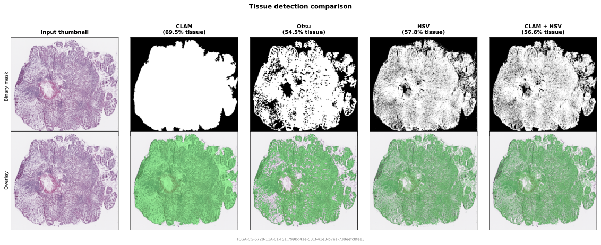

# Tissue Detection

Tissue detectors run on a **low-resolution thumbnail** and produce a binary mask indicating tissue regions. The mask guides the sampler to only propose coordinates within tissue. This is a coarse check -- it runs once per slide.

For fine-grained per-tile quality checks on the actual extracted patch pixels, see [Filters](filters.md).

<figure markdown="span">
  
  <figcaption>Comparison of the built-in tissue detectors on a TCGA slide. The CLAM detector includes contour-based area filtering, which removes small isolated components.</figcaption>
</figure>

## OtsuTissueDetector

Grayscale Otsu thresholding. Converts to grayscale, applies Gaussian blur, then uses Otsu's method to separate tissue (dark) from background (bright). Optionally applies morphological closing and removes small connected components.

This is the pipeline default (`PatchPipeline` uses it when no detector is specified).

```python
from wsistream.tissue import OtsuTissueDetector

detector = OtsuTissueDetector(
    blur_ksize=7,           # Gaussian blur kernel size
    morph_close_ksize=5,    # elliptical kernel for morphological closing (0 to disable)
    min_area_ratio=0.001,   # remove components smaller than this fraction of total area (0 to disable)
)
```

!!! note
    This is **not** the same as CLAM's tissue detection. CLAM thresholds the saturation channel in HSV space, not grayscale intensity. Use `CLAMTissueDetector` to match CLAM's behavior.

## CLAMTissueDetector

Reimplements the tissue segmentation from [CLAM](https://github.com/mahmoodlab/CLAM) (`wsi_core/WholeSlideImage.py`). Thresholds the saturation channel in HSV space, applies median blur (before thresholding), morphological closing with a square kernel, then filters contours by net area (parent area minus holes) with hole sorting and truncation.

Defaults match CLAM's `create_patches_fp.py`.

```python
from wsistream.tissue import CLAMTissueDetector

detector = CLAMTissueDetector(
    sthresh=8,            # saturation threshold
    sthresh_up=255,       # upper bound for cv2.threshold
    use_otsu=False,       # fixed threshold (True: Otsu on saturation instead)
    mthresh=7,            # median blur kernel (applied to saturation before thresholding)
    close=4,              # square kernel for morphological closing (0 to disable)
    a_t=100,              # min net foreground area
    a_h=16,               # min hole area
    max_n_holes=8,        # keep N largest holes per contour
    ref_patch_size=512,   # reference for area scaling
)
```

The `a_t` and `a_h` thresholds are scaled internally by `ref_patch_size^2 / (downsample_x * downsample_y)`, matching CLAM's behavior. The pipeline passes the downsample factor automatically.

## HSVTissueDetector

Per-pixel HSV range filtering applied to the thumbnail. A pixel is classified as tissue if its hue, saturation, and value all fall within the specified ranges.

Defaults match the HSV ranges from the Midnight paper ([Karasikov et al., 2025](https://arxiv.org/abs/2504.05186)).

```python
from wsistream.tissue import HSVTissueDetector

detector = HSVTissueDetector(
    hue_range=(90, 180),    # hue range (0-180 in OpenCV)
    sat_range=(8, 255),     # saturation range (0-255)
    val_range=(103, 255),   # value range (0-255)
)
```

!!! note
    This applies the HSV check to the **thumbnail** to produce a tissue mask. Midnight applies the same HSV check **per-tile** on extracted patches to decide whether to accept or reject them. For that behavior, use [`HSVPatchFilter`](filters.md).

## CombinedTissueDetector

Logical AND of multiple detectors. A pixel is classified as tissue only if **all** detectors agree.

```python
from wsistream.tissue import CombinedTissueDetector, CLAMTissueDetector, HSVTissueDetector

detector = CombinedTissueDetector(detectors=[
    CLAMTissueDetector(),
    HSVTissueDetector(),
])
```

## Writing your own

```python
from wsistream.tissue.base import TissueDetector

class MyDetector(TissueDetector):
    def detect(self, thumbnail, downsample=(1.0, 1.0)):
        # thumbnail: RGB uint8, shape (H, W, 3)
        # downsample: (scale_x, scale_y) of thumbnail relative to level 0
        return ...  # boolean mask, shape (H, W)
```
