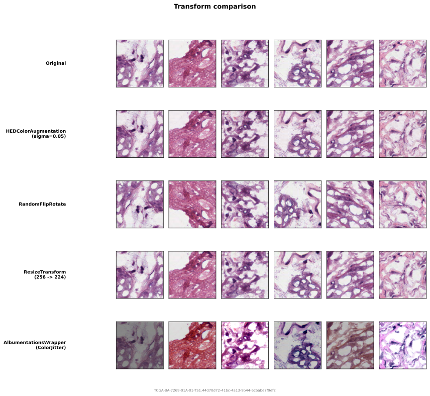

# Transforms

Transforms augment and preprocess patches after extraction and filtering. wsistream includes **pathology-specific** transforms that are not available in general-purpose libraries. For standard vision augmentations, use [albumentations](https://albumentations.ai/) through the included wrapper.

All transforms operate on numpy arrays `(H, W, 3)` and preserve `uint8` dtype, unless they are explicitly a normalization step (which outputs `float32` and should be last in the chain).

<figure markdown="span">
  
  <figcaption>Each row shows the same source patches after applying a single transform. HEDColorAugmentation simulates staining variation; RandomFlipRotate applies random flips and 90-degree rotations; ResizeTransform changes spatial resolution; AlbumentationsWrapper applies standard vision augmentations.</figcaption>
</figure>

## Pathology-specific

### HEDColorAugmentation

Decomposes the image into Hematoxylin, Eosin, and DAB stain channels, applies random multiplicative perturbation to each channel, and converts back to RGB. This simulates staining variation across labs and scanners. Used by Midnight ([Karasikov et al., 2025](https://arxiv.org/abs/2504.05186)).

```python
from wsistream.transforms import HEDColorAugmentation

transform = HEDColorAugmentation(
    sigma=0.05,    # perturbation intensity (default)
    seed=None,     # random seed
)
```

The `sigma` parameter controls augmentation intensity. Higher values produce more aggressive color variation.

### NormalizeTransform

Per-channel mean/std normalization. Converts `uint8` to `float32`. Should be the **last** transform in a chain since it changes the dtype.

Requires explicit `mean` and `std` -- there are no defaults. Choose values to match your model's expected normalization.

```python
from wsistream.transforms import NormalizeTransform

# ImageNet normalization
transform = NormalizeTransform(mean=(0.485, 0.456, 0.406), std=(0.229, 0.224, 0.225))

# Symmetric normalization (maps [0, 255] to [-1, 1])
transform = NormalizeTransform(mean=(0.5, 0.5, 0.5), std=(0.5, 0.5, 0.5))
```

!!! note
    If your training code handles normalization (e.g., inside the model or the DataLoader collate function), you do not need this here. Avoid double-normalizing.

## Utility transforms

### ResizeTransform

Resizes to a square target size. Useful when the extraction patch size (e.g., 256) differs from the model input size (e.g., 224).

```python
import cv2
from wsistream.transforms import ResizeTransform

transform = ResizeTransform(
    target_size=224,                     # output width and height
    interpolation=cv2.INTER_LINEAR,      # OpenCV interpolation flag
)
```

### RandomFlipRotate

Random horizontal/vertical flips and 90-degree rotations. Standard for pathology since tissue orientation is arbitrary.

```python
from wsistream.transforms import RandomFlipRotate

transform = RandomFlipRotate(
    p_hflip=0.5,    # probability of horizontal flip
    p_vflip=0.5,    # probability of vertical flip
    p_rot90=0.5,    # probability of 90-degree rotation (1, 2, or 3 quarter turns)
    seed=None,       # random seed
)
```

## Standard augmentations via albumentations

For augmentations like color jitter, Gaussian blur, grayscale conversion, and solarization, use `AlbumentationsWrapper`:

```python
import albumentations as A
from wsistream.transforms import AlbumentationsWrapper

transform = AlbumentationsWrapper(A.Compose([
    A.HorizontalFlip(p=0.5),
    A.VerticalFlip(p=0.5),
    A.RandomRotate90(p=0.5),
    A.ColorJitter(brightness=0.4, contrast=0.4, saturation=0.2, hue=0.1, p=0.8),
    A.ToGray(p=0.2),
    A.GaussianBlur(blur_limit=7, sigma_limit=(0.1, 2.0), p=0.5),
    A.Solarize(threshold=128, p=0.2),
]))
```

## Composing transforms

Use `ComposeTransforms` to chain multiple transforms. They are applied in order.

```python
from wsistream.transforms import (
    ComposeTransforms, HEDColorAugmentation, RandomFlipRotate,
    ResizeTransform, NormalizeTransform,
)

pipeline_transforms = ComposeTransforms(transforms=[
    HEDColorAugmentation(sigma=0.05),
    RandomFlipRotate(),
    ResizeTransform(target_size=224),
    NormalizeTransform(mean=(0.485, 0.456, 0.406), std=(0.229, 0.224, 0.225)),  # last
])
```

## Writing your own

```python
from wsistream.transforms.base import PatchTransform

class MyTransform(PatchTransform):
    def __call__(self, image):
        # image: numpy array (H, W, 3), uint8
        return ...  # transformed image, same shape
```
