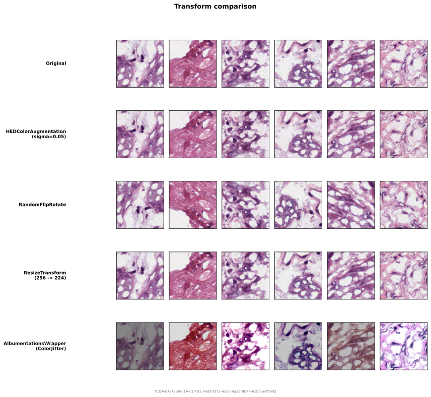
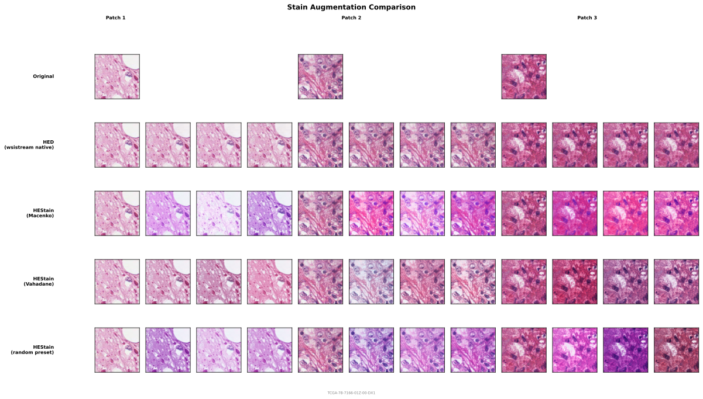

# Transforms

Transforms augment and preprocess patches after extraction and filtering. wsistream includes **pathology-specific** transforms that are not available in general-purpose libraries. For standard vision augmentations, use [albumentations](https://albumentations.ai/) through the included wrapper.

All transforms operate on numpy arrays `(H, W, 3)` and preserve `uint8` dtype, unless they are explicitly a normalization step (which outputs `float32` and should be last in the chain).

<figure markdown="span">
  
  <figcaption>Each row shows the same source patches after applying a single transform. HEDColorAugmentation simulates staining variation; RandomFlipRotate applies random flips and 90-degree rotations; ResizeTransform changes spatial resolution; AlbumentationsWrapper applies standard vision augmentations.</figcaption>
</figure>

## Pathology-specific

### HEDColorAugmentation

Decomposes the image into Hematoxylin, Eosin, and DAB stain channels, perturbs each channel `i` as `s_i' = alpha_i * s_i + beta_i`, and converts back to RGB. This simulates staining variation across labs and scanners. The perturbation was introduced by [Tellez et al. (2018)](https://arxiv.org/abs/1808.05896), which draws `alpha` and `beta` per channel from two uniform distributions; [Tellez et al. (2019)](https://doi.org/10.1016/j.media.2019.101544) reports the intensity ranges. Also used by Midnight ([Karasikov et al., 2025](https://arxiv.org/abs/2504.05186)).

```python
from wsistream.transforms import HEDColorAugmentation

transform = HEDColorAugmentation(
    sigma=0.05,       # alpha ~ U(1 - sigma, 1 + sigma); 0.05 = Tellez "light", 0.2 = "strong"
    sigma_bias=0.0,   # beta ~ U(-sigma_bias, sigma_bias); disabled by default, see warning
    seed=None,        # random seed
)
```

`sigma` controls the multiplicative term. Higher values produce more aggressive color variation.

!!! warning "`sigma` and `sigma_bias` are not on the same scale"
    `alpha` is a ratio, so it is invariant to the stain-space convention and the published sigma values port directly. `beta` is an absolute offset in stain space, so its meaning depends on that convention.

    The reference implementations that apply the published sigma to `beta` ([HistomicsTK](https://digitalslidearchive.github.io/HistomicsTK/histomicstk.preprocessing.augmentation.html), StainTools) work in SDA space scaled to roughly `[0, 255]`. wsistream uses `skimage.color.separate_stains`, whose output for typical H&E tissue has channel means near `0.02` and maxima near `0.25`. A `beta` of +/-0.05 there is several times the channel mean: it swamps the stain signal and turns tissue yellow, cyan or purple instead of producing a plausible stain shift.

    `sigma_bias` therefore defaults to `0.0`. If you enable it, scale it to your data's stain-channel magnitude (order `1e-3` for skimage HED output) and inspect the output visually. For reference, [OpenMidnight](https://github.com/MedARC-AI/OpenMidnight) applies `s_i + U(-0.05, 0.05)` to `skimage.rgb2hed` output with no multiplicative term (`dinov2/data/augmentations.py`, class `hed_mod`), which sits deliberately in this aggressive regime.

!!! tip "Alternative: `albumentations.HEStain`"
    `HEDColorAugmentation` uses skimage's **fixed** HED deconvolution matrix, so it perturbs stain channels defined by a global average rather than by your slide's actual stain vectors. [`A.HEStain`](https://explore.albumentations.ai/transform/HEStain) estimates the stain matrix per image (Macenko or Vahadane) and applies both a multiplicative and an additive term on its own concentration scale, which sidesteps the scale trap above. Prefer it when stain vectors vary a lot across your cohort; see [Stain augmentation via albumentations](#stain-augmentation-via-albumentations) below.

### NormalizeTransform

Per-channel mean/std normalization. Converts `uint8` to `float32`. Should be the **last** transform in a chain since it changes the dtype.

Requires explicit `mean` and `std` -- there are no defaults. Choose values to match your model's expected normalization.

```python
from wsistream.transforms import NormalizeTransform

# ImageNet normalization
transform = NormalizeTransform(mean=(0.485, 0.456, 0.406), std=(0.229, 0.224, 0.225))

# Symmetric normalization (maps [0, 255] to [-1, 1])
transform = NormalizeTransform(mean=(0.5, 0.5, 0.5), std=(0.5, 0.5, 0.5))
```

!!! note
    If your training code handles normalization (e.g., inside the model or the DataLoader collate function), you do not need this here. Avoid double-normalizing.

## Utility transforms

### ResizeTransform

Resizes to a square target size. Useful when the extraction patch size (e.g., 256) differs from the model input size (e.g., 224).

```python
import cv2
from wsistream.transforms import ResizeTransform

transform = ResizeTransform(
    target_size=224,                     # output width and height
    interpolation=cv2.INTER_LINEAR,      # OpenCV interpolation flag
)
```

### RandomFlipRotate

Random horizontal/vertical flips and 90-degree rotations. Standard for pathology since tissue orientation is arbitrary.

```python
from wsistream.transforms import RandomFlipRotate

transform = RandomFlipRotate(
    p_hflip=0.5,    # probability of horizontal flip
    p_vflip=0.5,    # probability of vertical flip
    p_rot90=0.5,    # probability of 90-degree rotation (1, 2, or 3 quarter turns)
    seed=None,       # random seed
)
```

## Standard augmentations via albumentations

For augmentations like color jitter, Gaussian blur, grayscale conversion, and solarization, use `AlbumentationsWrapper`:

```python
import albumentations as A
from wsistream.transforms import AlbumentationsWrapper

transform = AlbumentationsWrapper(A.Compose([
    A.HorizontalFlip(p=0.5),
    A.VerticalFlip(p=0.5),
    A.RandomRotate90(p=0.5),
    A.ColorJitter(brightness=0.4, contrast=0.4, saturation=0.2, hue=0.1, p=0.8),
    A.ToGray(p=0.2),
    A.GaussianBlur(blur_limit=7, sigma_limit=(0.1, 2.0), p=0.5),
    A.Solarize(threshold=128, p=0.2),
]))
```

!!! note "Seeding across DataLoader workers"
    Albumentations keeps its own RNG, seeded from the numpy global RNG. PyTorch does not reseed the numpy global per DataLoader worker, so with fork-based workers every worker would otherwise replay the same augmentation sequence. `AlbumentationsWrapper` prevents this: it owns an RNG that `PatchPipeline` reseeds per worker and pushes a derived seed into albumentations via `set_random_seed`. Set `seed` on `PatchPipeline`, not on the wrapper. This requires albumentations >= 2.0; with older versions the wrapper warns and augmentations stay tied to the numpy global RNG.

### Stain augmentation via albumentations

Albumentations (>= 2.0) includes a built-in [`HEStain`](https://explore.albumentations.ai/transform/HEStain) transform that performs Macenko or Vahadane stain augmentation — decomposing the image into stain concentration channels, randomly perturbing them, and reconstructing. This is a more principled alternative to `HEDColorAugmentation` for simulating staining variation across labs and scanners.

```python
import albumentations as A
from wsistream.transforms import AlbumentationsWrapper

# Macenko-based stain augmentation
transform = AlbumentationsWrapper(A.Compose([
    A.HEStain(
        method="macenko",
        intensity_scale_range=(0.7, 1.3),   # multiplicative perturbation per stain channel
        intensity_shift_range=(-0.2, 0.2),  # additive perturbation per stain channel
        augment_background=False,
        p=0.5,
    ),
]))

# Vahadane-based (better structure preservation)
transform = AlbumentationsWrapper(A.Compose([
    A.HEStain(method="vahadane", p=0.5),
]))

# Random preset (fastest -- uses predefined stain matrices, no per-image SVD)
transform = AlbumentationsWrapper(A.Compose([
    A.HEStain(method="random_preset", p=0.5),
]))
```

The two key parameters controlling augmentation strength are:

- **`intensity_scale_range`** (default `(0.7, 1.3)`): multiplicative scaling per stain channel. Narrower range = subtler color variation.
- **`intensity_shift_range`** (default `(-0.2, 0.2)`): additive shift per stain channel. Controls baseline staining variation.

<figure markdown="span">
  
  <figcaption>Comparison of stain augmentation methods. Each group shows the original patch followed by three augmented versions. All methods use default parameters (intensity_scale_range=(0.7, 1.3), intensity_shift_range=(-0.2, 0.2), p=1.0).</figcaption>
</figure>

## Composing transforms

Use `ComposeTransforms` to chain multiple transforms. They are applied in order.

```python
from wsistream.transforms import (
    ComposeTransforms, HEDColorAugmentation, RandomFlipRotate,
    ResizeTransform, NormalizeTransform,
)

pipeline_transforms = ComposeTransforms(transforms=[
    HEDColorAugmentation(sigma=0.05),
    RandomFlipRotate(),
    ResizeTransform(target_size=224),
    NormalizeTransform(mean=(0.485, 0.456, 0.406), std=(0.229, 0.224, 0.225)),  # last
])
```

## Writing your own

```python
from wsistream.transforms.base import PatchTransform

class MyTransform(PatchTransform):
    def __call__(self, image):
        # image: numpy array (H, W, 3), uint8
        return ...  # transformed image, same shape
```
