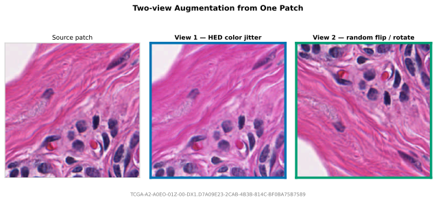
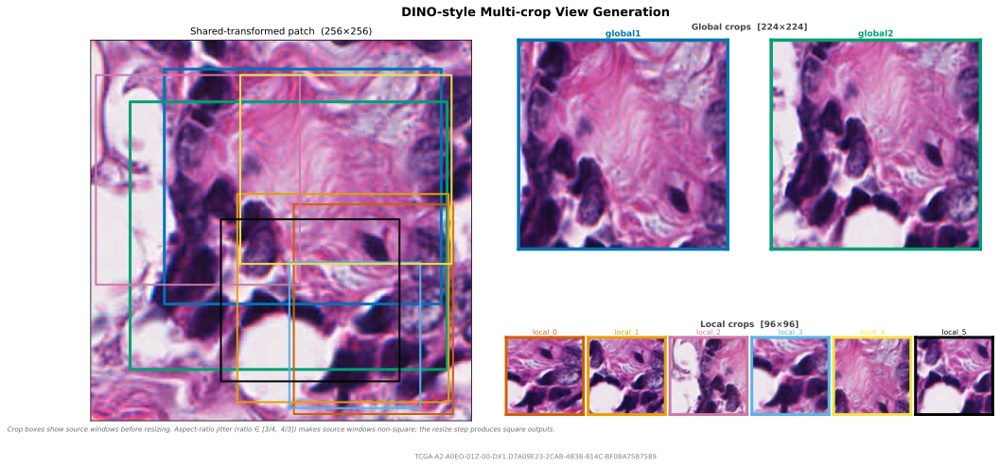

# Views

Views produce multiple model inputs from one sampled tissue location. This covers two-view contrastive learning ([SimCLR](https://arxiv.org/abs/2002.05709), [BYOL](https://arxiv.org/abs/2006.07733), [MoCo](https://arxiv.org/abs/1911.05722)), teacher-student setups, [DINO](https://arxiv.org/abs/2104.14294), and [DINOv2](https://arxiv.org/abs/2304.07193)-style multi-crop training.


## ViewConfig

Each `ViewConfig` defines one named output. `count` repeats a view configuration with independent crop and transform draws, producing names like `local_0`, `local_1`, and so on.

```python
from wsistream.views import ViewConfig

ViewConfig(
    name="view1",
    transforms=...,
)
```

| Parameter | Default | Description |
|-----------|---------|-------------|
| `name` | — (required) | Output key in `PatchResult.views` or the PyTorch batch dict. Must not collide with reserved keys: `image`, `x`, `y`, `level`, `patch_size`, `slide_path`, `mpp`, `tissue_fraction`, or any `SlideMetadata` field. Collisions are caught at pipeline construction time. |
| `transforms` | `None` | Per-view augmentation chain applied after optional cropping. `None` means the view receives the shared-transformed patch (or the raw patch if no `shared_transforms`) without further augmentation. |
| `crop` | `None` | `RandomResizedCrop` applied before `transforms`. `None` means no spatial crop — the full patch is used. |
| `count` | `1` | Number of independent views generated from this config. `count=1` keeps the name as-is; `count > 1` produces `name_0`, `name_1`, … with independent crop and transform draws. |
| `mpp_override` | `None` | Target MPP for a same-center slide re-read. Requires slide MPP metadata; cannot be combined with `shared_transforms`. |
| `patch_size_override` | `None` | Pixels to request from the slide for an `mpp_override` re-read. Requires `mpp_override`. When `None`, the primary sampler's `patch_size` is reused. |

## RandomResizedCrop

`RandomResizedCrop` first samples a source window from the extracted patch, then resizes that window to `size x size`. The extracted patch is the array produced by the sampler and slide backend before view-specific crops are applied. For example, with `RandomSampler(patch_size=256, ...)`, the extracted patch is a 256x256 image, and all crop scales below are relative to that 256x256 image.

`scale` is the sampled source-window area as a fraction of the extracted patch area. For a 256x256 extracted patch, `scale=(0.05, 0.4)` samples crop windows between about 3277 and 26214 pixels before resizing. With the default aspect-ratio range, those windows can have different widths and heights. The model still receives fixed-size tensors because every sampled window is resized to `size x size`. If the sampled source window is smaller than `size x size`, resizing upsamples it; this is part of the standard random-resized-crop behavior used by DINO.

| Parameter | Description |
|-----------|-------------|
| `size` | Output side length in pixels. `size=96` returns a 96×96 crop. **Required.** |
| `scale` | `(min, max)` range for the source-window area as a fraction of the extracted patch area. Must satisfy `0 < min <= max <= 1`. **Required — there is no default** because the right value depends on the training recipe. Common values: DINO v1 global `(0.4, 1.0)`, DINOv2 global `(0.32, 1.0)`, DINO/DINOv2 local `(0.05, 0.4)` / `(0.05, 0.32)`, SimCLR `(0.08, 1.0)`. |
| `ratio` | `(min, max)` aspect-ratio range for the sampled source window. Log-uniformly sampled. Default: `(3/4, 4/3)` (matches [torchvision](https://pytorch.org/vision/stable/generated/torchvision.transforms.RandomResizedCrop.html)). |
| `interpolation` | OpenCV interpolation flag for resizing. Default: `cv2.INTER_LINEAR`. Use `cv2.INTER_AREA` for downscaling, `cv2.INTER_LANCZOS4` for high-quality upscaling. |
| `seed` | Optional seed. Default: `None`. Note: overridden by the pipeline's seed — set `seed` on `PatchPipeline` instead. |

## Multi-view augmentation

<figure markdown="span">
  
  <figcaption>Two independently augmented views from the same extracted patch.</figcaption>
</figure>

Multi-view training reads one patch and applies N independent transform chains. `shared_transforms` runs once before the per-view transforms, which is useful for shared geometric changes such as flips and rotations.

```python
from wsistream.pipeline import PatchPipeline
from wsistream.backends import OpenSlideBackend
from wsistream.sampling import RandomSampler
from wsistream.tissue import OtsuTissueDetector
from wsistream.transforms import ComposeTransforms, HEDColorAugmentation, RandomFlipRotate
from wsistream.views import ViewConfig

pipeline = PatchPipeline(
    slide_paths=slide_paths,
    backend=OpenSlideBackend(),
    tissue_detector=OtsuTissueDetector(),
    sampler=RandomSampler(patch_size=256, num_patches=-1, target_mpp=0.5),
    views=[
        ViewConfig(
            name="view1",
            transforms=ComposeTransforms([
                HEDColorAugmentation(sigma=0.08),  # first stochastic color view
            ]),
        ),
        ViewConfig(
            name="view2",
            transforms=ComposeTransforms([
                HEDColorAugmentation(sigma=0.08),  # second stochastic color view
            ]),
        ),
    ],
    shared_transforms=RandomFlipRotate(),  # shared geometry before view-specific color
    pool_size=8,
    patches_per_slide=100,
    cycle=True,
)

for result in pipeline:
    view1 = result.views["view1"]
    view2 = result.views["view2"]
```

## DINO-style multi-crop

<figure markdown="span">
  
  <figcaption>DINO-style global and local crops from one extracted patch. Each output thumbnail is framed in the color of its source crop box.</figcaption>
</figure>

`RandomResizedCrop` samples a spatial crop as a fraction of the extracted patch area, then resizes it to the requested square size. This matches the crop structure used by DINO and DINOv2: large global crops and several smaller local crops.

In the standard DINO setup, the two global crops and all local crops are sampled independently from the same image passed to the augmentation pipeline. The local crops are not constrained to lie inside either global crop. DINO sends the two global crops through the teacher, and sends both global and local crops through the student. The scale ranges control how much of the extracted patch each source window covers before resizing: global crops cover a large fraction, local crops cover a smaller fraction. The official DINO implementation sets `global_crops_scale=(0.4, 1.0)` and `local_crops_scale=(0.05, 0.4)` ([arguments](https://github.com/facebookresearch/dino/blob/main/main_dino.py#L107-L117)), then uses `RandomResizedCrop(224, scale=global_crops_scale)` for the two global views and `RandomResizedCrop(96, scale=local_crops_scale)` for each local view ([augmentation code](https://github.com/facebookresearch/dino/blob/main/main_dino.py#L435-L456)).

DINOv2 exposes the same crop structure through its default SSL config: `global_crops_scale=(0.32, 1.0)`, `local_crops_scale=(0.05, 0.32)`, `local_crops_number=8`, `global_crops_size=224`, and `local_crops_size=96` ([default config](https://github.com/facebookresearch/dinov2/blob/main/dinov2/configs/ssl_default_config.yaml)). The architecture-specific ViT-L/14 and ViT-g/14 training configs override `local_crops_size` to 98 ([ViT-L/14](https://github.com/facebookresearch/dinov2/blob/main/dinov2/configs/train/vitl14.yaml), [ViT-g/14](https://github.com/facebookresearch/dinov2/blob/main/dinov2/configs/train/vitg14.yaml)). The DINOv2 augmentation class applies these values through `RandomResizedCrop(global_crops_size, scale=global_crops_scale)` and `RandomResizedCrop(local_crops_size, scale=local_crops_scale)` ([augmentation code](https://github.com/facebookresearch/dinov2/blob/main/dinov2/data/augmentations.py)).

```python
from wsistream.views import RandomResizedCrop, ViewConfig

pipeline = PatchPipeline(
    ...,
    sampler=RandomSampler(patch_size=256, target_mpp=0.5),
    views=[
        ViewConfig(
            name="global",
            crop=RandomResizedCrop(size=224, scale=(0.4, 1.0)),  # 40-100% of extracted patch
            count=2,
            transforms=ComposeTransforms([
                HEDColorAugmentation(sigma=0.05),  # mild global-view color jitter
            ]),
        ),
        ViewConfig(
            name="local",
            crop=RandomResizedCrop(size=96, scale=(0.05, 0.4)),  # 5-40% of extracted patch
            count=6,  # local_0 ... local_5 (original DINO uses count=8; adjust to your setup)
            transforms=ComposeTransforms([
                HEDColorAugmentation(sigma=0.10),  # stronger local-view color jitter
            ]),
        ),
    ],
    shared_transforms=RandomFlipRotate(),
)
```

## Same-location magnification views

Views can also trigger extra WSI reads at a different target MPP. The primary sampler defines the tissue location; each `mpp_override` view keeps the same level-0 center and reads its own patch around that center. If the requested same-center view extends beyond the slide boundary, wsistream preserves the center and lets the backend pad out-of-bounds pixels. This supports detail/context pairs such as a high-resolution cell-level view and a lower-magnification tissue-context view.

```python
pipeline = PatchPipeline(
    ...,
    sampler=RandomSampler(patch_size=256, target_mpp=0.5),
    views=[
        ViewConfig(
            name="detail",
            transforms=ComposeTransforms([
                HEDColorAugmentation(sigma=0.05),
            ]),
        ),
        ViewConfig(
            name="context",
            mpp_override=2.0,          # read a lower-magnification context patch
            patch_size_override=256,   # number of pixels to request at that level
            transforms=ComposeTransforms([
                HEDColorAugmentation(sigma=0.05),
            ]),
        ),
    ],
)
```

`mpp_override` requires slide MPP metadata, like `RandomSampler(target_mpp=...)` and `MultiMagnificationSampler`.

## PyTorch batches

`WsiStreamDataset` returns one tensor key per view, together with the same coordinate and metadata keys used by the rest of the PyTorch integration.

```python
for batch in loader:
    global0 = batch["global_0"]  # (B, 3, 224, 224)
    global1 = batch["global_1"]  # (B, 3, 224, 224)
    local0 = batch["local_0"]   # (B, 3, 96, 96)

    x = batch["x"]
    y = batch["y"]
    paths = batch["slide_path"]
```

## Rules

- `transforms` and `views` are mutually exclusive.
- `views` must contain at least one `ViewConfig`.
- View names must be unique after `count` expansion.
- View names must not collide with reserved batch keys (`image`, `x`, `y`, `level`, `patch_size`, `slide_path`, `mpp`, `tissue_fraction`, or any `SlideMetadata` field name). Collisions are detected at pipeline construction time.
- `shared_transforms` requires `views` to be set (cannot be used in single-view mode).
- `shared_transforms` runs once on the primary extracted patch before per-view crop and transform processing. Every view — including those with `transforms=None` — receives the shared-transformed patch. There is no per-view opt-out: if one view must skip `shared_transforms` (e.g. a clean teacher view in a teacher-student setup), apply the geometry transform inside each view's own `transforms` chain instead and omit `shared_transforms`.
- `shared_transforms` cannot be combined with `mpp_override` views.
- `patch_size_override` requires `mpp_override` to be set.
- `mpp_override` requires the slide to have MPP metadata. An error is raised at extraction time if the slide lacks it.
- Views with `mpp_override` re-read from the slide once and then run their own crop and transform chain for each `count` repetition.
- Seeds set on individual transforms or crops inside `ViewConfig` are overridden by the pipeline's seed at construction time. Use `seed` on `PatchPipeline` for reproducibility.
