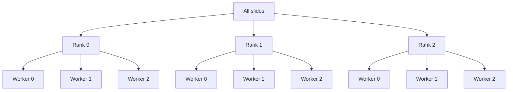

# Distributed Data Parallel (DDP)

With DDP, each rank (GPU) must see **different data**. `wsistream.torch` provides `partition_slides_by_rank` to handle this, and `WsiStreamDataset` handles worker-level partitioning automatically.

## Two-level sharding

Sharding happens at two levels:

1. **Across DDP ranks**: split slides so each GPU processes different slides
2. **Across DataLoader workers**: within each rank, split that rank's slides across workers



## Implementation

```python
import os

import torch
import torch.distributed as dist
import torch.nn as nn
from torch.utils.data import DataLoader

from wsistream.backends import OpenSlideBackend
from wsistream.sampling import RandomSampler
from wsistream.tissue import OtsuTissueDetector
from wsistream.torch import MonitoredLoader, WsiStreamDataset, partition_slides_by_rank


def main():
    dist.init_process_group("nccl")
    rank = dist.get_rank()
    world_size = dist.get_world_size()
    local_rank = int(os.environ["LOCAL_RANK"])
    torch.cuda.set_device(local_rank)
    device = torch.device(f"cuda:{local_rank}")

    # Level 1: partition slides across ranks
    my_slides = partition_slides_by_rank("/data/tcga", rank=rank, world_size=world_size)

    # Level 2: worker partitioning is handled inside WsiStreamDataset
    dataset = WsiStreamDataset(
        slide_paths=my_slides,
        backend=OpenSlideBackend(),
        tissue_detector=OtsuTissueDetector(),
        sampler=RandomSampler(patch_size=256, num_patches=1000, target_mpp=0.5),
        pool_size=8,
        patches_per_slide=100,
        seed=42 + rank,
    )

    loader = DataLoader(dataset, batch_size=64, num_workers=4, pin_memory=True)
    mon = MonitoredLoader(loader, dataset=dataset, device=device, log_every=100)

    model = nn.parallel.DistributedDataParallel(
        MyModel().to(device), device_ids=[local_rank],
    )
    optimizer = torch.optim.AdamW(model.parameters(), lr=1e-4)

    for step, batch in enumerate(mon):
        images = batch["image"].to(device, non_blocking=True)
        loss = model(images).mean()  # placeholder — replace with your actual loss

        optimizer.zero_grad()
        loss.backward()
        optimizer.step()

        payload = mon.mark_step(extra={"train/loss": float(loss.detach())})
        if payload is not None and rank == 0:  # all ranks call mark_step, only rank 0 logs
            print(payload)

        if step + 1 >= total_steps:
            break  # step-based training: patches are randomly sampled

    dist.destroy_process_group()
```

Launch with:

```bash
torchrun --nproc_per_node=4 train.py
```

## Auto-detection

`partition_slides_by_rank()` can auto-detect rank and world size from environment variables set by `torchrun`:

```python
# Equivalent when launched via torchrun:
my_slides = partition_slides_by_rank(all_slides)  # reads RANK and WORLD_SIZE from env
```

!!! warning "Uneven rank partitions"
    If the number of slides is not divisible by `world_size`, some ranks will get more slides than others. This is usually fine for step-based streaming (`cycle=True` with a fixed number of training steps), but it can deadlock finite `cycle=False` DDP loops because ranks end up doing different numbers of backward passes.

## Key details

- **Seed per rank**: use `seed=base_seed + rank` so each rank samples different patches from its slides.
- **Fresh pipeline per worker**: `WsiStreamDataset.__iter__` creates a new `PatchPipeline` each time. This avoids sharing mutable state (like open file handles) across worker processes.
- **Fixed rank assignment**: slides are assigned to ranks once (`slides[rank::world_size]`) and stay fixed. Unlike [`DistributedSampler`](https://pytorch.org/docs/stable/data.html#torch.utils.data.distributed.DistributedSampler) which reshuffles across ranks each epoch, our approach keeps slides local to each rank. This is intentional — WSI files are large and benefit from local caching. Diversity across cycles comes from random patch sampling within each slide, not from reshuffling slide assignments.
- **No DistributedSampler**: `DistributedSampler` is for map-style datasets. With [`IterableDataset`](https://pytorch.org/docs/stable/data.html#iterable-style-datasets), PyTorch provides [no built-in DDP sharding](https://discuss.pytorch.org/t/using-iterabledataset-with-distributeddataparallel/92589) — sharding is handled by `partition_slides_by_rank` (rank level) and `WsiStreamDataset` (worker level). See the [PyTorch DDP tutorial](https://pytorch.org/tutorials/intermediate/ddp_tutorial.html) for general DDP background.

## Operational rules

1. **Use step-based training with `cycle=True`.** Patches are randomly sampled from tissue regions, so there is no guarantee of seeing the same patches twice — a traditional "epoch" (one full pass over every sample) is not meaningful. Define training by a number of steps instead.
2. **Never use `DistributedSampler`.** It's for map-style datasets. Sharding is handled by `partition_slides_by_rank` (rank level) and `WsiStreamDataset` (worker level).
3. **You need at least as many slides as ranks.** `partition_slides_by_rank` raises if a rank gets zero slides.
4. **Uneven slide counts are fine for infinite streaming.** With `cycle=True` and a fixed step count, all ranks do the same number of backward passes regardless of slide count imbalance.
5. **Uneven slide counts are dangerous for finite loops.** With `cycle=False`, ranks with fewer slides finish earlier, causing DDP to deadlock waiting for backward passes that never come.
6. **Throughput is limited by the slowest rank.** If one rank has slower storage or more complex slides, all ranks wait at each gradient sync. Use per-rank logging to detect stragglers.
7. **Debug one slide and one rank before scaling.** Run `python examples/train_single_gpu.py --slides /data/tcga --steps 10` first. Only add DDP complexity once the pipeline works.

## Full example

See `examples/train_ddp.py` in the repository for a complete working example including DDP setup, MonitoredLoader, and training loop.
