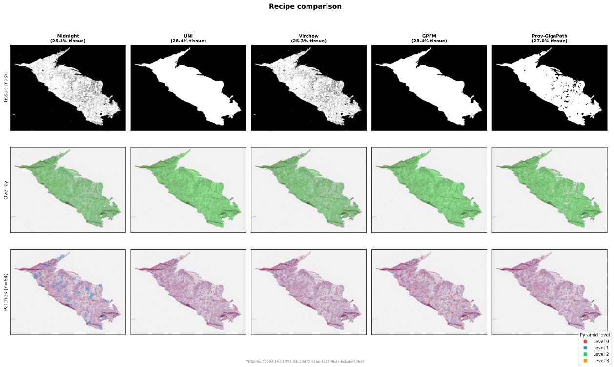

# Paper Recipes

wsistream can approximate the data pipelines of several pathology foundation models. This is a selected (not exhaustive) collection -- each recipe shows how to configure the pipeline to match a specific paper's preprocessing as closely as possible.

| Paper | Patch size | Resolution | Tissue detection | Tissue threshold | Training data |
|-------|-----------|------------|-----------------|-----------------|---------------|
| [Midnight](midnight.md) | 256x256 | 0.25, 0.5, 1.0, 2.0 mpp | U-Net (not open-sourced) | 40% | 384M tiles from 92K WSIs |
| [UNI](uni.md) | 256x256 / 512x512 | 20x (0.5 mpp) | CLAM | not specified | ~100M tiles from 100K WSIs |
| [Virchow](virchow.md) | 392x392 | 5x/10x/20x/40x mixed | Trained FCN (not open-sourced) | 65% | 3.1M WSIs |
| [GPFM](gpfm.md) | 512x512 | Native (level 0) | CLAM (dataset-specific presets) | contour-based | 190M tiles from 72K WSIs |
| [Prov-GigaPath](prov-gigapath.md) | 256x256 | 20x (0.5 mpp) | Otsu on luminance | 10% | 1.38B tiles from 171K WSIs |
| [Phikon](phikon.md) | 224x224 | 20x (0.5 mpp) | U-Net (not open-sourced) | 60% | 456M tiles from 58K WSIs |

<figure markdown="span">
  
  <figcaption>Same WSI processed with each recipe's tissue detection and sampling configuration. Top: binary tissue masks. Middle: mask overlay. Bottom: 64 sampled patch locations (colored by pyramid level).</figcaption>
</figure>
